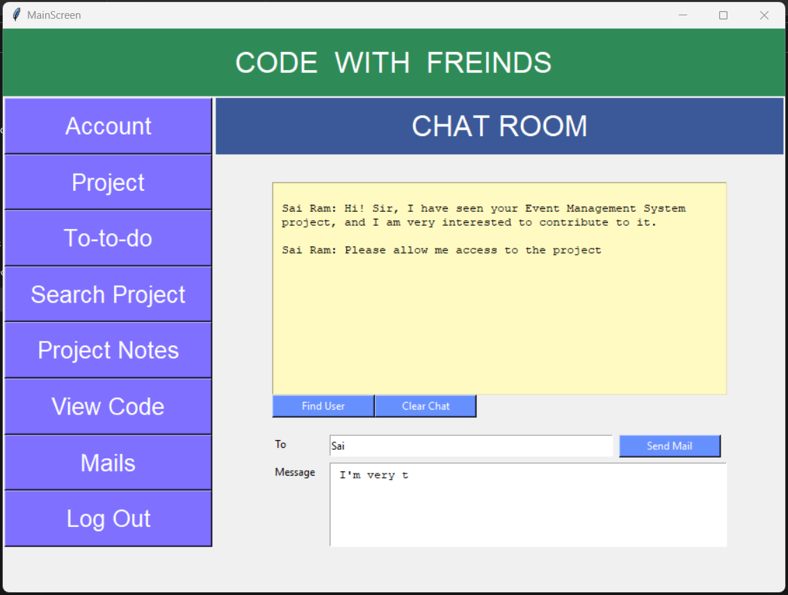
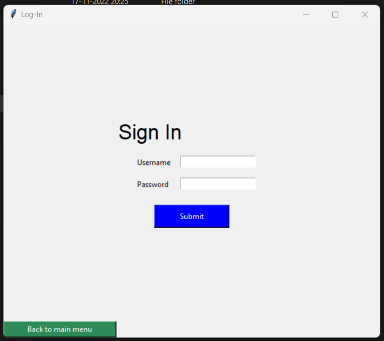
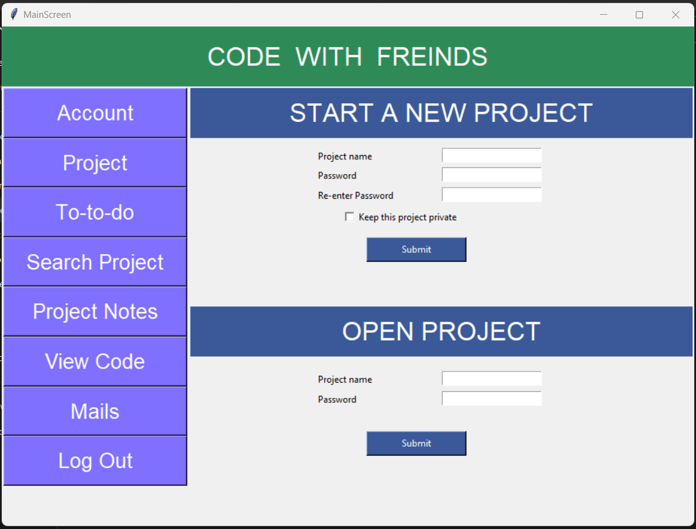

# 🚀 Exciting Project Alert: Code With Friends 🚀

Are you ready to level up your coding game? 🎯 Join me on this incredible journey with "Code With Friends," a collaborative coding platform that will revolutionize the way you approach programming!

## 🌟 What is "Code With Friends"?

"Code With Friends" is an innovative web application designed to bring together aspiring developers, seasoned programmers, and tech enthusiasts in one vibrant community. This platform offers a plethora of features to facilitate seamless collaboration, project management, and skill-sharing.

## 🔥 Key Features

- **Project Collaboration**: Work on exciting projects with like-minded individuals from all around the world. Collaborate, brainstorm, and build remarkable solutions together!

- **To-Do List**: Organize your tasks and stay on top of your project's progress with our intuitive To-Do List feature. Keep yourself and your team focused and productive.

- **Search Projects**: Explore a wide range of open-source projects and connect with their admins. Find inspiration, learn from others, and contribute to projects you're passionate about.

- **Project Notes**: Document your ideas, goals, and plans with the Project Notes feature. Detail your project's development journey and track your progress effortlessly.

- **Code Editor**: Write, edit, and run code directly on the platform. Experience a seamless coding environment that simplifies your programming experience.

- **Chat Room**: Connect with other members through our interactive Chat Room. Discuss ideas, ask questions, and exchange knowledge in real-time.

## 💡 Why Choose "Code With Friends"?

- **Global Community**: Embrace diversity and learn from talented individuals worldwide. Expand your network and make lifelong connections.

- **Skill Development**: Sharpen your coding skills by working on diverse projects. Learn new techniques, tools, and coding languages through hands-on experience.

- **Open Discussion**: Engage in open discussions, share knowledge, and seek advice from experienced developers. Elevate your understanding of programming concepts.

- **Resourceful Learning**: Access a vast library of coding resources, tutorials, and guides. Stay updated with the latest trends and advancements in the tech world.

🤝 Join the "Code With Friends" community today and unlock a world of opportunities for personal and professional growth.

👉 Sign up now at [Insert Website Link] and embark on an incredible coding journey with us!

#CodeWithFriends #CodingCommunity #TechEnthusiasts #Collaboration #ProgrammingJourney #TechInnovation #WebDevelopment #JoinTheCommunity

## Screenshots

### Account Info

### Chatroom

### Login

### Project

### Todo List

